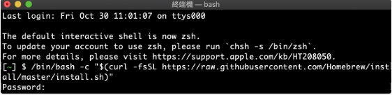
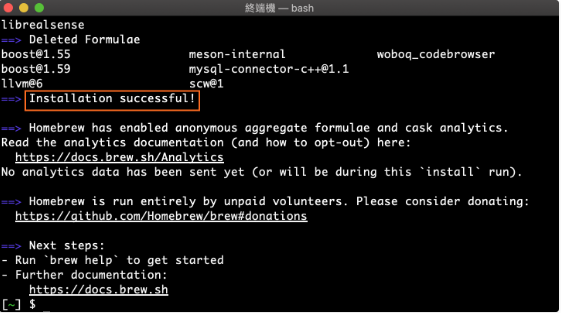

# Alphitter
<h3>一個和朋友交流的社交平台</h3>
<h4> 👉🏻 <a href="https://ansticefish.github.io/simple-twitter-front-end/#/signIn"> 點我到網站，直接玩看看！ </a> </h4>
<br>

> # 功能介紹
<br>

## <strong> 前台 <strong>
<br>

<br>
<br> 
 <h4> 擁有和 Twitter 相似的社交功能: </h4>
 
  * 註冊、登入個人帳號
  * 瀏覽所有貼文
  * 推文、回覆和對推文按讚
  * 打造個人profile
  * 瀏覽、追蹤其他使用者

<br>

## <strong> 後台管理 <strong>
<br>

<br>
<br>
 <h4> 透過管理員帳號(帳號：root；密碼：12345678)你能快速掌握前台資訊: </h4>
 
  * 一覽所有推文、刪除使用者推文
  * 掌握所有使用者資訊與活躍程度
 
<br>
<br>


> # 環境與規格
<br>

* Alphitter 採用 Vue 2 打造，並使用 Vue Router 建立路由

<br>

> # 安裝說明
<br>

<strong>從來沒有使用過終端機的人，請先做相關設定！</strong>
<br>

<strong>Mac使用者請參照Mac版的說明，Windows使用者請參照Windows版的說明</strong>
<br>

<strong>若已經安裝過Node.js，可直接跳至「下載專案」區！</strong>

<br>

> ## 環境設定 (安裝Git與Node.js)
<br>

 ## Mac使用者：
<br>

  * 打開應用程式庫裡的「terminal」軟體
<br>

  * 查看 terminal 的視窗上方邊框，是否有出現bash，若有，請進入「安裝Homebrew」的步驟，若沒有，請輸入下方指令轉換：
<br>

```
chsh -s /bin/bash
```
<br>

  * 安裝Homebrew：輸入下方指令並按Enter
<br>

```
/bin/bash -c "$(curl -fsSL https://raw.githubusercontent.com/Homebrew/install/HEAD/install.sh)"
```
<br>

  * 看到最後一行出現"Password"時，請輸入開機時的密碼，並按Enter送出
<br>

 
<br>

<small> (圖片取自Alpha Camp) </small>
<br>

  * 當terminal出現以下訊息，按Enter鍵
<br>

```
Press RETURN to continue or any other key to abort
```
<br>

  * 當程式執行結束，若在程式碼中上方看見"installation successful!"表示安裝成功(如下圖)。若沒有看見，也可以輸入下方指令，如有出現版本號(如：Homebrew 2.5.8)，就表示成功！
<br>

 
<br>

<small> (圖片取自Alpha Camp) </small>
<br>

```
brew --version
```
<br>

  * 接著輸入以下指令，安裝Git
<br>

```
brew install git
```
<br>

  * 輸入下列指令後，若有出現版本號(如：git version 2.24.3)就表示Git安裝成功！
<br>

```
git --version
```
<br>

  * 接下來輸入指令，確認是否安裝 Xcode Cli 
<br>

```
 xcode-select -p                                
 ```
<br>

Note: 有回傳檔案路徑如:/Applications/Xcode.app/Contents/Developer就代表有，可以繼續進行下一個步驟！若沒有，請先輸入以下指令安裝：
<br>

```
xcode-select --install
```
<br>

  * 輸入指令安裝 nvm 
<br>

```
curl -o- https://raw.githubusercontent.com/creationix/nvm/v0.34.0/install.sh | bash
```
<br>

  * 安裝後，務必重新啟動terminal，並輸入以下指令
<br>

```
command -v nvm
```
<br>

Note: 若下一行出現了："nvm" 就表示成功了！

<br>

  * 接連輸入下方指令，安裝與套用Node.js
<br>

```
nvm install 14.16.0
```
<br>

```
nvm use 14.16.0
```
<br>

恭喜你完成了環境設定！接下來請直接跳至「下載專案」部分，將專案下載下來！

------------------------------------------------------------------------------------------------------------------------
<br>

 ##  Windows使用者：
<br> 
    
  * 到<a href="https://git-scm.com/">此網站</a>，點擊"Download for Windows"下載與安裝，安裝過程只要依序按Next鍵，不需做額外設定。
  <br>
  
  * 安裝完成後打開名為 "Git Bash" 的檔案。
  <br>
  
    Note：接下來會需要在Git Bash中輸入許多指令，若想直接將指令貼入介面中，請使用shift + insert鍵，或可以直接在Git Bash中按右鍵，選擇 "paste" 貼上指令！
<br>

  * 到<a href="https://github.com/coreybutler/nvm-windows/releases"> nvm-windows</a> ，往下滑到 Assets列表，找到「nvm-setup.exe」，將它下載並執行。
<br>

    Note: 請注意「nvm-setup.exe」檔案存放的路徑中，不可以有空白或中文。例如C:\Users\使用者 (也就是C槽的Users資料夾中的「使用者」資料夾)或是C:\Users\my file(C槽中的「my file」資料夾)，都可能導致執行錯誤。因此若C槽的使用者名稱為中文或含空白，建議將nvm設定檔存到其他地方。
<br>

  * 先關閉再重新開啟Git Bash，輸入以下指令，若有出現版本號(如：1.1.7)，即表示安裝成功！
<br>

```
nvm version
```
<br>

  * 接連輸入以下指令，安裝與套用Node.js
<br>

```
nvm install 14.16.0
```
<br>

```
nvm use 14.16.0
```
<br>

若出現錯誤，有可能是權限問題，試著用管理員身分開啟Git Bash，再重新安裝一次！

<br>


> ## 下載專案 
<br>

  * 接連在terminal或git bash輸入下列指令：

<br>

```
git clone https://github.com/Ansticefish/simple-twitter-front-end.git
```
<br>


```
cd simple-twitter-front-end
```
<br>

```
npm install
```
<br>

> ## 啟動專案
<br>

  * 輸入以下指令啟動專案：

<br>

```
npm run serve
```
<br>

此時，程式會花一點時間啟動，等啟動完畢會出現一段話，如：
<br>
<br>

```
App running at:
  - Local:   http://localhost:8080/
  - Network: http://192.168.1.105:8080/
```
<br>

只要將任何一段網址貼到瀏覽器中(例如Chrome)，就可以看到Alphitter的內容了！
