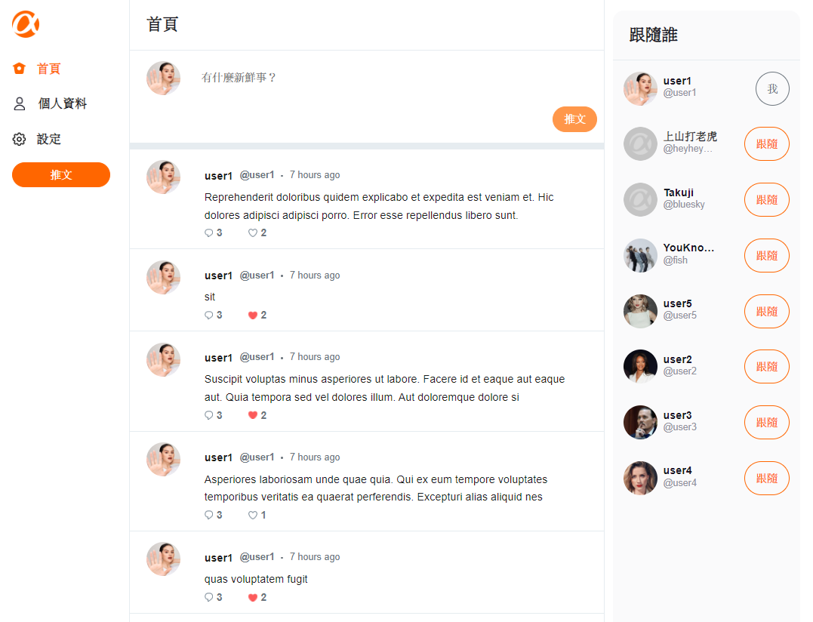
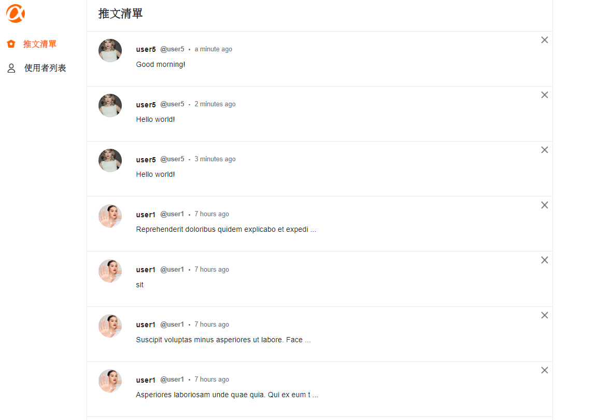

# Alphitter
<h3>一個和朋友交流的社交平台</h3>
<h4> 👉🏻 <a href="https://ansticefish.github.io/simple-twitter-front-end/#/signIn"> 點我到網站，直接玩看看！ </a> </h4>
<br>

> # 功能介紹
<br>

## <strong> 前台 <strong>
<br>

<br>
<br> 
 <h4> 擁有和 Twitter 相似的社交功能: </h4>
 
  * 註冊、登入個人帳號
  * 瀏覽所有貼文
  * 推文、回覆和對推文按讚
  * 打造個人profile
  * 瀏覽、追蹤其他使用者

<br>

## <strong> 後台管理 <strong>
<br>

<br>
<br>
 <h4> 透過管理員帳號(帳號：root；密碼：12345678)你能快速掌握前台資訊: </h4>
 
  * 一覽所有推文、刪除使用者推文
  * 掌握所有使用者資訊與活躍程度
 
<br>
<br>


> # 環境與規格
<br>

* Alphitter 採用 Vue 2 打造，並使用 Vue Router 建立路由

<br>

> # 安裝說明
<br>
 
<strong>從來沒有使用過終端機或沒有安裝Node.js的人，請依照下方連結內容做環境設定！</strong>

<br>

<strong><a href="https://codepen.io/zoe19940213/pen/jOZLMjW"> Click Me !</a></strong>

<br>

<strong>若已經安裝過Node.js，可直接跳至「下載專案」區！</strong>

 <br>

> ## 下載專案 
<br>

  * 接連在terminal或git bash輸入下列指令：

<br>

```
git clone https://github.com/Ansticefish/simple-twitter-front-end.git
```
<br>


```
cd simple-twitter-front-end
```
<br>

```
npm install
```
<br>

> ## 啟動專案
<br>

  * 輸入以下指令啟動專案：

<br>

```
npm run serve
```
<br>

此時，程式會花一點時間啟動，等啟動完畢會出現一段話，如：
<br>
<br>

```
App running at:
  - Local:   http://localhost:8080/
  - Network: http://192.168.1.105:8080/
```
<br>

只要將任何一段網址貼到瀏覽器中(例如Chrome)，就可以看到Alphitter的內容了！
